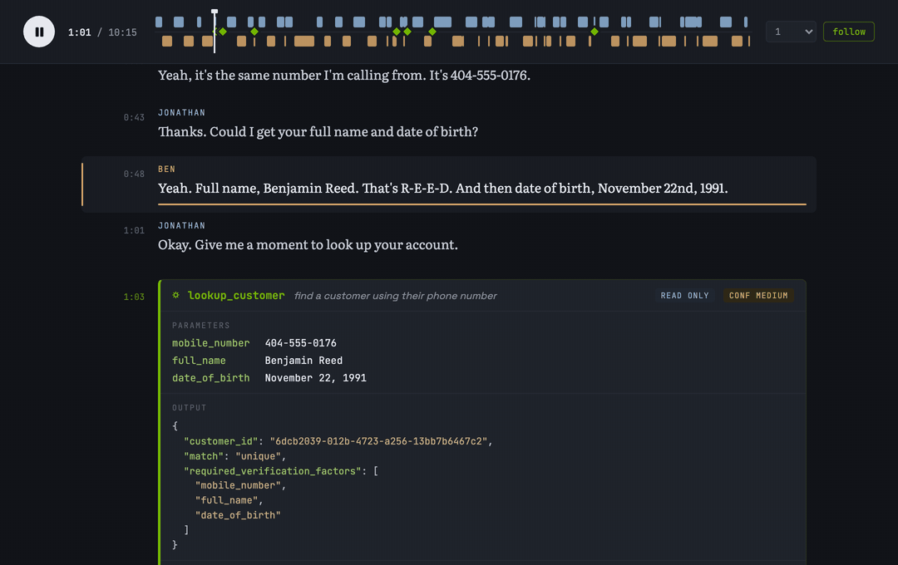

# Specific Labs Voice Agent Sample



*Playback at 4x speed: the annotated transcript follows the call audio while tool calls surface inline with their arguments and recorded outputs.*

## 1. Tool-call annotations

The function-calling deliverable is the
`conversations/<conversation-id>/transcripts/annotated-transcript.json` file
inside each conversation. These files organize the function-call annotations as chronological conversation trajectories:

- `responses_create_params.input` contains the chronological system message,
  customer and agent messages, structured function calls, and function outputs.
- Each function call has a tool name and JSON-string arguments.
- Each function output is stored under the same `call_id` as the call.
- `event_metadata` records call placement in seconds against `audio/full.wav`,
  the inferred call window, annotation confidence, and state effect.
- `responses_create_params.tools` contains the JSON-Schema tool definitions
  used for that conversation.

Here is an exact annotation excerpt from the
[retail missing-package transcript](conversations/retail-missing-package/transcripts/annotated-transcript.json).
The call and result appear consecutively in `responses_create_params.input`:

```json
[
  {
    "arguments": "{\"product_reference\":\"blue-noise-canceling-headphones\",\"include_inventory\":true}",
    "call_id": "rm-003",
    "name": "get_product",
    "type": "function_call",
    "id": "rm-003",
    "status": "completed"
  },
  {
    "type": "function_call_output",
    "call_id": "rm-003",
    "output": "\n\n{\"product_reference\":\"blue-noise-canceling-headphones\",\"variant\":{\"color\":\"blue\"},\"inventory\":{\"same_variant_in_stock\":true}}"
  }
]
```

The matching timing annotation in `event_metadata` is:

```json
{
  "event_index": 26,
  "kind": "function_call",
  "call_id": "rm-003",
  "source": "transcripts/transcript.txt",
  "source_label": "check replacement inventory",
  "annotation_confidence": "high",
  "state_effect": "read_only",
  "placement_seconds": 211.65,
  "placement_after_text": null,
  "placement_before_text": null,
  "audio_reference": {
    "path": "audio/full.wav",
    "start_seconds": null,
    "end_seconds": null,
    "inferred_window_seconds": [
      211.65,
      219.65
    ]
  }
}
```

This sample includes the full function-result payload and call-placement
timing.

All annotated transcripts are under [conversations/](conversations/):

- Airline: [family reservation](conversations/airline-family-reservation/transcripts/annotated-transcript.json) and [flight status and connection risk](conversations/flight-status-connection-risk/transcripts/annotated-transcript.json)
- Automotive service: [vehicle pickup readiness](conversations/vehicle-pickup-readiness/transcripts/annotated-transcript.json)
- Banking: [account email and card application](conversations/banking-account-email-card-application/transcripts/annotated-transcript.json), [declined card while traveling](conversations/banking-declined-card-travel/transcripts/annotated-transcript.json), [duplicate streaming charge](conversations/duplicate-streaming-charge/transcripts/annotated-transcript.json), [missing referral reward](conversations/banking-referral-missing-reward/transcripts/annotated-transcript.json), and [transaction dispute session](conversations/banking-transaction-dispute-session/transcripts/annotated-transcript.json)
- Insurance: [proof of vehicle coverage](conversations/proof-of-vehicle-coverage/transcripts/annotated-transcript.json)
- Pharmacy: [travel refill](conversations/pharmacy-travel-refill/transcripts/annotated-transcript.json)
- Retail: [damaged-item replacement](conversations/retail-damaged-item-replacement/transcripts/annotated-transcript.json), [missing package](conversations/retail-missing-package/transcripts/annotated-transcript.json), and [refund bank fee](conversations/retail-refund-bank-fee/transcripts/annotated-transcript.json)
- Telecom: [data-usage cleanup](conversations/telecom-data-usage-cleanup/transcripts/annotated-transcript.json)

## 2. Per-domain tool registries

The tool registry for each domain is located at
`domains/<domain>/tool_registry.json`. Each registry defines tool names,
descriptions, JSON-Schema argument contracts, and typed result contracts.

- [Airline tool registry](domains/airline/tool_registry.json)
- [Automotive-service tool registry](domains/automotive_service/tool_registry.json)
- [Banking tool registry](domains/banking/tool_registry.json)
- [Insurance tool registry](domains/insurance/tool_registry.json)
- [Pharmacy tool registry](domains/pharmacy/tool_registry.json)
- [Retail tool registry](domains/retail/tool_registry.json)
- [Telecom tool registry](domains/telecom/tool_registry.json)

## 3. CSR policies and reconstructed state

The policy used by each CSR is located at `domains/<domain>/policy.md` and is
also embedded in the system message of each annotated transcript.

- [Airline policy](domains/airline/policy.md)
- [Automotive-service policy](domains/automotive_service/policy.md)
- [Banking policy](domains/banking/policy.md)
- [Insurance policy](domains/insurance/policy.md)
- [Pharmacy policy](domains/pharmacy/policy.md)
- [Retail policy](domains/retail/policy.md)
- [Telecom policy](domains/telecom/policy.md)

Each conversation also has `state/initial_state.json` and
`state/final_state.json`. These are reconstructed from the annotated tool
results. They are not presented as exports from a source CRM or production
database. The [conversation manifest](conversation_manifest.json) links to
both state files for every conversation.

## 4. Required information, goals, and outcomes

Collected and read-back facts appear verbatim in the chronological speech
events in each annotated transcript. The matching `event_metadata` entries
provide start and end timestamps against the audio. The timestamped baseline
speech transcript is stored at
`conversations/<conversation-id>/transcripts/transcript.txt`.

The [conversation manifest](conversation_manifest.json) provides a one-line
goal, outcome label, outcome summary, scenario time, and file pointers for all
14 conversations. The [facts.json](facts.json) file provides the required information for all
14 conversations. It separates facts the agent had to collect from facts the
agent had to communicate, with each canonical value, exact spoken text,
speaker, event index, and audio start and end timestamp.

## 5. Turn-taking

All 14 conversations include:

- `transcripts/words.json` with word-level timestamps and speaker labels.
- `turn_taking.json` with turn segments, pause boundaries, backchannel and
  overlap candidates, and speaker metadata.

In each `transcripts/words.json`, the word sequence matches the annotated
speech and every word falls inside its utterance timestamp window.

## 6. Audio

All 42 delivered audio files are 48 kHz, 24-bit, mono PCM WAV files. Each
conversation includes synchronized `audio/full.wav`, `audio/speaker-1.wav`,
and `audio/speaker-2.wav` tracks.

The [audio manifest](audio_manifest.json) contains the exact audited sample
rate, bit depth, duration, channel count, and spectral measurements for every
file.

## 7. Emotion and paralinguistic annotations

Every timestamped speech event in each `annotated-transcript.json` now has an
`event_metadata[].annotations` array. Explicit parenthetical labels from the
human-annotated transcript source are stored with `type: "emotion"`; audible
event labels such as `[laughs]`, `[sighs]`, and `[lip smack]` are stored
separately with `type: "paralinguistic"`. Empty arrays mean that no supplied
source explicitly labeled that speech event; they do not mean the emotion was
neutral.

The same annotation type, label, and source are also attached to the
chronological message above:

- User speech: `responses_create_params.input[].annotations`
- Agent speech: `responses_create_params.input[].content[].annotations` on the
  `output_text` item

This keeps both the message-level view and the timestamped `event_metadata`
view complete for all 14 conversations. The `source_text` provenance token is
kept only in `event_metadata`; it is omitted from message-level annotations
because it is not part of the displayed message text.

For example:

```json
{
  "event_index": 65,
  "kind": "speech",
  "speaker": "Ethan",
  "role": "user",
  "source": "transcripts/transcript.txt",
  "annotations": [
    {
      "type": "emotion",
      "label": "relieved",
      "source": "human_annotated_transcript",
      "source_text": "(relieved)"
    },
    {
      "type": "paralinguistic",
      "label": "laughs",
      "source": "inline_transcript",
      "source_text": "[laughs]"
    }
  ],
  "audio_reference": {
    "path": "audio/full.wav",
    "start_seconds": 442.86,
    "end_seconds": 454.38
  }
}
```

The [`emotional_distribution.json`](emotional_distribution.json) file reports the
total speech-turn denominator, category counts, role breakdowns, and
per-conversation counts. The fourteen supplied human-annotated combined
transcripts cover every conversation and contribute 59 emotion-labeled turns
across 18 categories: 50 user turns and 9 agent turns. The remaining 616 of
675 speech turns have no supplied emotion label.

The distribution counts each speech event once from the timestamped
`event_metadata` copy, rather than double-counting the mirrored message-level
annotations.

## Known behavioral exception

In `banking-account-email-card-application` the enacted agent asks the
customer to read a one-time code aloud (about 03:25-03:50 in the audio) and
acknowledges it. The code never enters a tool argument, but the exchange
should not be treated as compliant agent behavior or used as a positive
training example for those turns.
